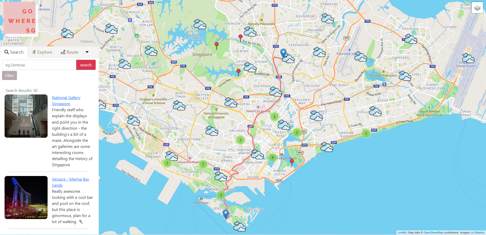
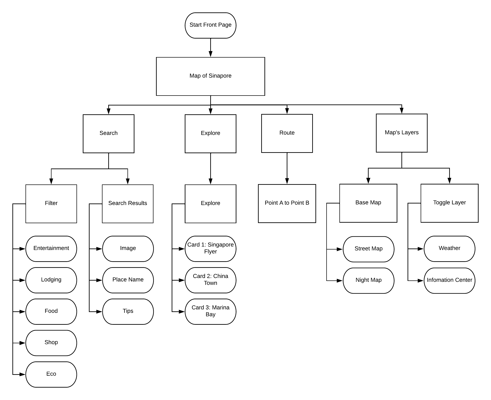
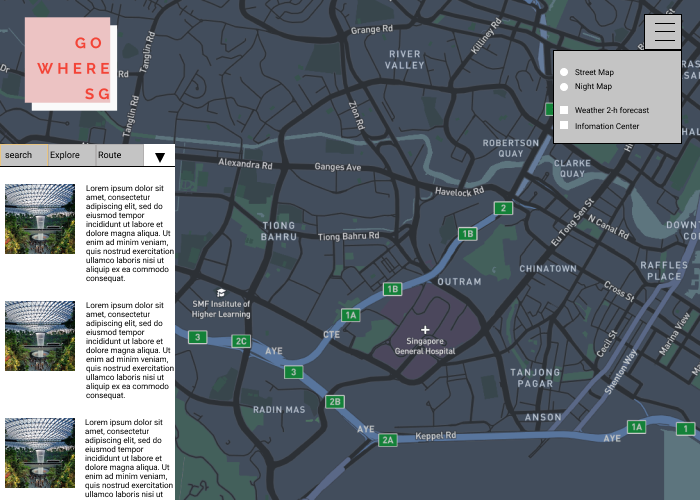
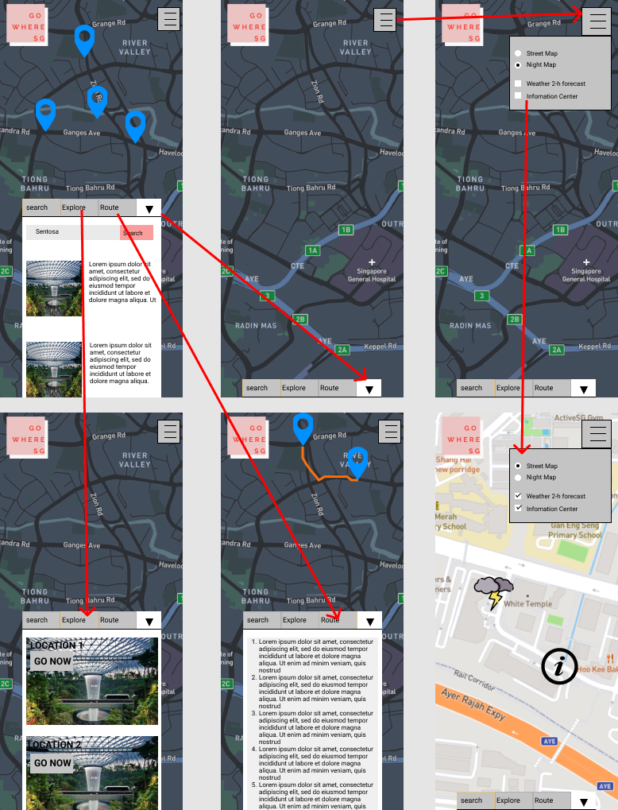
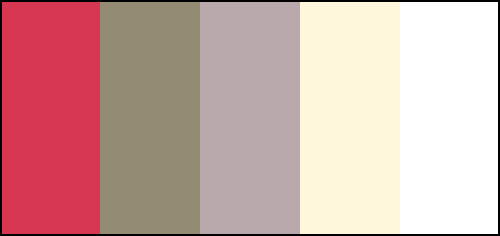

# GoWhereSg 
 

Access the live demo of the website [here](https://admiring-snyder-0686db.netlify.app/).

## Project Summary

**Project Context**

 _GoWhereSG_ is a mobile-responsive and interactive map application developed for both foreign and local tourist to be able to search for leisure activities around Singapore.

**User Goals**

The aim of users is to get recommendations based on their interest and have an easy time deciding on where to go within Singapore. Users will be able to plan and route from point to point based on weather conditions.

**Organisational Goals**

The app aims to provide users with recommendations from paid avenues that promotes their place of interest. Additionally, revenue through advertisements can be generated.

**Justification for the App**

While there are countless local map applications and tourism websites around, many of them do not consider an all inclusive map navigation, recommendation application. This can be fustrating for new visitors especially if they are unfamilar with the geography of the city state. They would need to hop between map applications and website recommendations.

With Singapore being situated around earth's equator, it expriences sporadic weather conditions such as with rainfall and thundery storms. This in turn affects planing of tour itineraries. Often, tourist would be caught off-guard in undesirable weather conditions, leading to their plans ruin.

Thus, GoWhereSG will include an all inclusive map and recommendation application which will inform users on the upcoming weather conditions.

## UX/UI

### **Strategy**
_User_
* Objective: To explore tourism activies within Singapore based on search results and recommendations

* Needs: Plan out itenery based on weather condition, location and reviews

* Demographics:
    * Users can come from all walks of life and age
    * Users are presumed to have little to no geographical knowledge of Singapore
    * Sufficient literacy in using technological devices

User Stories | Acceptance Criteria(s)
------------ | -------------
As a tourist, i want to have a search feature based on my interest so that i can visit places that i enjoy. | Filter function for area of interest.
As a tourist, i do not want to be hindered by bad weather while doing outdoor activities so that i can have the best local experience. | Feature that can allow users to see the weather forecast on the map.
As a tourist, i want to know how to travel towards my place of intrest so that i do not get lost and waste time. | A route feature that helps user navigate their way.

### **Scope**

_Functional Specifications_
* Search for activity

* Filter for search result

* Explore suggestions

* Route from start to end point

_Non-functional requirements_
* Mobile responsiveness
    * Achieved via the use of appropriate media queries and flex box

### **Structure**

 

### **Skeleton**

_Mobile Response_
 

_Desktop Response_
 

_Process of Application_
 

### **Surface**

_Colours_

 

* The main color scheme of the app follows a pink hue with a slight brown undertone 
To make the website vibrant, the color of pink of chosen for its main theme. This color edge user to be excited about exploring Singapore. Because the national colors consist of red and white, a pink hue would represent a closeness towards the purpose of GoWhereSG's website.

_Font Choice_
* The font used for the branding icon is Raleway. This font is used in a chic depiction of who we are at GoWhereSG

* Font size is are set to a readable size of no less than 16px (1rem)

* San-serif are used for the main search text such that old and young will be able to read the text with ease

## Features
1. **Users can search for activity**. Using FourSquare's API and best search results, users can get the best experiences based on the popularity of places within Singapore. This feature is implemented at the front page and also in the main map navigation bar. Whenever the search button is pressed, the service will fetch the search results along side images and tips from FourSquare and iterate it into the search contents.

2. **Filter for search function** This feature is used to narrow down the search results for the user. If the user would like to look for food, they would be able to checkbox to select the food option and search.

3. **Users can click on pin of search listings displays the name and address of location** To reduce cluter within the map, the clicking of pin to popup the location and address has been used. This will tell the user the infomation they need such after doing the search.

4. **Explore cards can be used as a suggestive refrence for users who do not know where to go** In the case that the user do not have any plans or need a suggestion, the explore tab on the navigation bar can be used. These cards can be clicked on and will bring the user to the location of the map.

5. **Routing can help users to navigate the local roads** Routing from point A to Point B can be especially useful to the user when they need to travel while on the go. Additionally the routing gives the user the calculated distance between points such that they can decide if the traveling time suits their needs.

_Limitations and future implementations_
* For routing, an input address bar To and From is needed to enhance the usefulness. As of the lastest version of GoWhereSG, the routing function will only be able to provide users direction by droping and placing markers.

## Testing

**Test Cases**

Access the test cases [here](https://github.com/MarcusCWD/GoWhereSG/blob/main/test-case/Test%20Case.pdf).

**Testing for Mobile Responsiveness**
 * Testing was done using chrome developer tool with variable width sizes from 330px to 1400px

## Technologies Used

* HTML5
    * To create the framework of the web app
* CSS3
    * To style various elements throughout the web app
* JavaScript
    * To include interactive elements throughout the web app
* [Bootstrap v5.0](https://getbootstrap.com/docs/5.0/getting-started/introduction/)
    * To create carousel
    * To create dropdown
    * To create checkbox
    * To create Navbar
    * To create collaps
* [Leaflet](https://leafletjs.com/)
    * To create the map of Singapore
    * To add in markers
    * To create layers and clusters for markers
* [Font Awesome](https://fontawesome.com/)
    * For icons in tab of navbar
* [Flaticon](https://www.flaticon.com/)
    * For customizing marker icons
* [Figma](https://www.figma.com/)
    * To create the skeleton mock up
* [Git](https://git-scm.com/)
    * For version control
* [GitHub](http://github.com)
    * To create repository
* [Netlify](https://www.netlify.com/)
    * To deploy web app
* [Google Font](https://fonts.google.com/)
    * To select font families used for web app (i.e. Raleway)

## Deployment

The web app is hosted using Netlify.

**Dependencies**

* [foursquare](http://foursquare.com/)
    * To obtain search results on searched locations 
    * To obtain pictures based on fsq_id
    * To obtain tips based on fsq_id
* [Data.Gov.Sg](https://data.gov.sg/dataset/realtime-weather-readings)
    * To obtain 2 hour forecast within Singapore
* [Axios](https://cdnjs.com/libraries/axios)
    * To call API

## Credits

* Leaflet markers' icons
    * Downloaded and edited from [Flaticon](https://www.flaticon.com/)

* Liedman routing machine
    * Plugin from [Liedman](https://www.liedman.net/)

* Singapore Flyer image
    * Downloaded from [Tiqets](https://www.tiqets.com/)

* China Town image
    * Downloaded from [Wowabouts](http://www.wowabouts.com/)

* Marina Bay Sands image
    * Downloaded from [Getyourguide](https://www.getyourguide.co.uk/)
    

